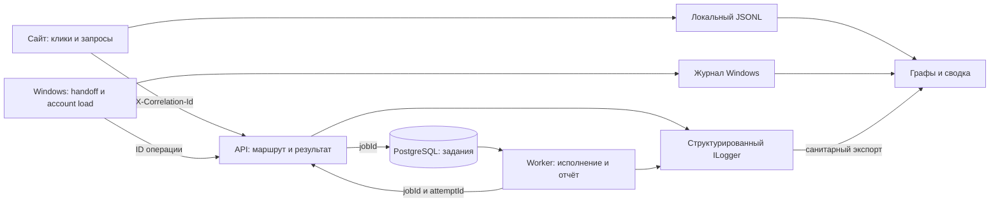
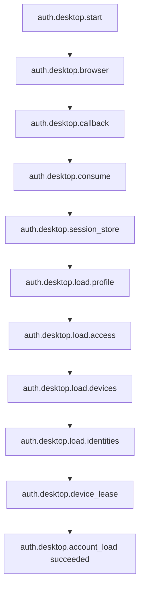

# VideoGrabber: диагностика и проверка пользовательских путей

Локальная реализация от 2026-10-07. Отчёт описывает код, а не состояние опубликованных контейнеров или установленного Windows EXE. Дизайн — выбранная владельцем концепция 2, Studio.

## Что собирается

| Поток | События | Где смотреть |
|---|---|---|
| Сайт | Разрешённые кнопки и переходы, 3D-действия, открытие/закрытие окон, состояния сцены, начало/результат API-запроса, ошибки JavaScript/ресурсов | `/web/?diagnostics=1`, экспорт JSONL |
| API | Начало/результат запроса, HTTP-метод, безопасный шаблон endpoint, код ответа, длительность, тип исключения | существующий ILogger, `VG_TELEMETRY` |
| Worker | Начало/результат задания, проверка/политика, результат передачи завершения серверу | существующий ILogger, `VG_TELEMETRY` |
| Windows Managed | Browser → callback → consume → session store; профиль/доступ/устройства/идентичности → lease → аккаунт | существующий `%LOCALAPPDATA%/VideoGrabber/logs` |
| Smoke/E2E | Начало и результат каждого проверяемого шага, время, тип сбоя, снимки и JUnit | каталог конкретного прогона |

Базовые поля: `schemaVersion`, UTC `timestamp`, `service`, `environment`, `revision`, `event`, `outcome`, `traceId`, `durationMs`. API дополнительно содержит шаблон маршрута и HTTP-код; задания — UUID `jobId`/`attemptId`. Windows сохраняет прежние `stage`, `status`, `jobId`, `exitCode` для совместимости. Неизвестная revision обозначается `UNKNOWN`; номер сборки Windows — отдельный `buildVersion`. Для релизного API/worker можно установить несекретные `VG_REVISION` и `VG_ENVIRONMENT` в уже утверждённом процессе публикации.

Браузер создаёт отдельный `X-Correlation-Id` для каждого своего API-запроса, связывает его с trace страницы через `parentTraceId`. API принимает только UUID, остальные значения заменяет. Windows handoff и загрузка аккаунта передают ID своей операции, без общего изменяемого HTTP-заголовка клиента. API после успешного создания задания связывает запрос с `jobId`; worker использует тот же UUID задания. Это корреляция событий, а не доказательство успешной доставки файла.

Не собираются поля ввода, email, тексты ошибок сервера, токены, cookies, auth codes/state, тела запросов/ответов, исходные URL и query. Сторонний fetch не получает диагностические заголовки и не журналируется. Неизвестный браузерный маршрут имеет имя `unmatched`; API использует endpoint template после выполнения routing. Произвольный HTTP-метод становится `OTHER`, чтобы не создавать неограниченные метрики.

WebGL журналирует `webgl.context_lost`, `webgl.context_restored`, `webgl.initialization_failed`, `webgl.render_failed`, `webgl.restoration_failed`. Поля ограничены именем сцены, профилем качества и DPR. Последние 20 графических событий сохраняются в `sessionStorage` текущей вкладки (`vg_webgl_incidents`), переживают reload и возвращаются с `previousPage=true`; исходные timestamp и traceId сохраняются после проверки формата, время повторного чтения записывается отдельно в replayedAt. Браузер не отправляет эти журналы на VPS автоматически. Диагностическая панель экспортирует их в JSONL вместе с текущими событиями. Smoke/E2E намеренно создаёт потерю контекста через стандартный `WEBGL_lose_context` и проверяет статичный резерв, запрет повторного показа неисправного canvas и восстановление. Такие `context_lost` в тестовом журнале ожидаемы и не означают случайное падение GPU.

## Просмотр на сайте

Обычная страница не показывает диагностическую панель. Откройте локальную версию:

```text
http://127.0.0.1:8892/web/?diagnostics=1
```

Панель показывает число событий, ошибок и вытесненных записей, простой граф длительностей, кнопку экспорта. Буфер — 500 небольших событий в памяти текущей страницы; перезагрузка очищает его. Ничего не отправляется внешнему аналитическому сервису. Экспорт включает coverage и текущие численные Web Vitals. Это измерения одного браузера, не production percentile.

## Повторяемые smoke и E2E

Из корня репозитория:

```powershell
python scripts/Test-Web.py --serve --mode smoke
node --test tests/web/*.test.cjs tests/web/*.test.mjs
python -m unittest discover -s tests/diagnostics -v
```

`--serve` поднимает отдельную статическую копию на свободном loopback-порту. API отвечает явным `503 preview_backend_unavailable`, POST запрещён; рабочая БД и учётные записи не используются. Обычный smoke проверяет HTML/CSS/JS и bundle. Реальная readiness проверяется отдельно, без статической fixture:

```powershell
python scripts/Test-Web.py --mode smoke --base-url http://127.0.0.1:8080 --health
```

Для E2E нужны уже установленный Selenium и совместимый официальный Edge WebDriver. Скрипт не скачивает зависимости или driver. На этом компьютере проверялось так:

```powershell
python scripts/Test-Web.py --serve --mode all --edge-driver "C:/Users/Oleg/.cache/selenium/msedgedriver/win64/154.0.4258.48/msedgedriver.exe"
```

Проверяются живая 3D-сцена, четыре перехода, 11 объектов сцены и их описания, реальные клики по 3D-поверхностям, четыре тарифных диалога с реальными ценами, круглые значки шагов, Enter/Escape/крестик/кнопка закрытия и возврат фокуса, невалидный email, корректная причина Google-ошибки в fixture, все сцены при ширине 390/700/1050 px, повторное переключение reduced motion, наличие событий и отсутствие JS/resource ошибок. Свежий профиль браузера изолирован; внешние HTTPS-запросы заблокированы. Не активируются Google/email отправка, оплата, реальное скачивание, задачи пользователя. E2E принимает только loopback origin. Публичный smoke возможен только с явными `--mode smoke --allow-remote-smoke`; сертификаты проверяются, redirects не выполняются.

Каждый запуск создаёт новый каталог `artifacts/qa/<UTC>-<runId>` (или явно заданный новый `--output`): `results.json`, `junit.xml`, `steps.jsonl`, browser JSONL и снимки. Отсутствующие ресурсы, вытесненные события и отсутствие данных блокируют зелёный E2E. Непроверенные auth/payment/native/device сценарии перечислены как `notRun`. Первый неудачный прогон не перезаписывается повтором.

В GitHub workflow добавлены Node-регрессии и изолированный HTTP smoke. Браузерный E2E остаётся явной локальной командой; GitHub Actions после этих изменений ещё не запускались.

## Графы и сводка журналов

```powershell
python scripts/Build-DiagnosticsReport.py artifacts/qa/<run-directory> --output artifacts/qa/<new-report-directory>
```

Можно передать несколько JSONL файлов или явные каталоги. Чтение нерекурсивное, без очистки, без выполнения команд из журналов. Поддерживаются новый JSONL, прежний Windows JSONL и структурированный console/Docker envelope с `VG_TELEMETRY`. Отчёт включает только разрешённые поля, интерактивный выбор trace, временной граф этапов, события/ошибки по сервисам, p50/p95 длительностей. `no_data`, `incomplete`, `issues_found`, `no_errors_observed` различаются; последнее не означает готовность продукта.

Лимиты чтения: 512 файлов, 4 MiB на файл, 64 MiB суммарно, 64 KiB на строку, 10000 событий. Окно — 30 дней по времени события, даже если старый файл скопирован сегодня. Пропуски/повреждения/вытеснение показаны явно. Сохранённые отчёты не имеют бессрочного назначения: владельцу следует включить их в согласованную 30-дневную политику хранения. Этот скрипт не удаляет файлы.

## Метрики и tracing

Без новых NuGet-зависимостей добавлены `ActivitySource` и `Meter` с именем `VideoGrabber.Platform`:

- `vg.http.requests`, `vg.http.duration` (ms): шаблон endpoint, нормализованный метод, outcome;
- `vg.worker.jobs`, `vg.worker.duration` (ms): outcome, без UUID в metric labels.

Коллектор OpenTelemetry/Prometheus/Grafana, постоянный серверный dashboard и публикация `/metrics` не настроены. Это отдельное изменение инфраструктуры. Существующие Docker/journald retention и квоты в этой работе не изменялись и не подтверждены. Windows уже имеет ротацию 2 MiB/файл, 32 MiB суммарно и срок до 30 дней; её тесты выполняются в отдельном fixture-каталоге. Новый расширенный DEBUG не включался; legacy переключатель DEBUG не следует считать автоматически ограниченным по времени.

## Карта системы



## Диагностика Windows-входа



Событие успешного handoff означает получение сессии, а не успешное отображение аккаунта. `account_load` имеет собственный результат. Нативная авторизация пользователя в установленной версии пока не воспроизведена; новые события появятся только в сборке с этими изменениями. Установка/публикация требует отдельного решения владельца.

## Интерактивные сцены — уточнение 2026-10-07

`scene-actions.js` содержит подробные руководства и связывает 3D-объекты с обычными HTML-кнопками. Workflow и круглые значки открывают шаги «Ссылка», «Формат», «Файл». Pricing открывает существующий plan dialog. Модели ноутбука, планшета и Telegram-телефона открывают описания соответствующих сценариев. Windows показывает отдельный ноутбук вместо пересекающихся Play/карточки. Изображения экранов — схематичная иллюстрация интерфейса, без личных данных и выдуманных результатов загрузок.

Scene actions журналируются как `scene:<feature>`, значки как `guide:<topic>`, открытие/закрытие диалогов — `dialog.open`/`dialog.close`. Действие мыши допускается только для основной кнопки и одного pointerId; затухающие объекты другой сцены не принимают клики.

Static preview Google-тест намеренно получает HTTP 503. Это ожидаемая отрицательная проверка: показана причина отсутствующего локального backend и ссылка на рабочий сайт. В журнале 503 остаётся ошибкой запроса; поэтому агрегатор может сообщать `issues_found` даже при прошедшем E2E. Не превращайте это в production-успех и не скрывайте такие события.
